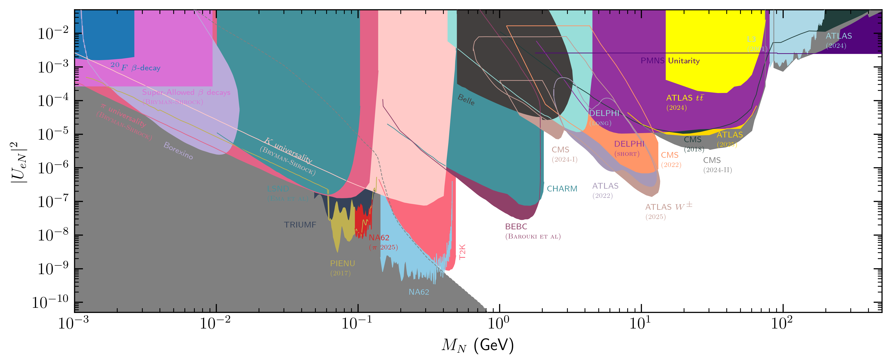
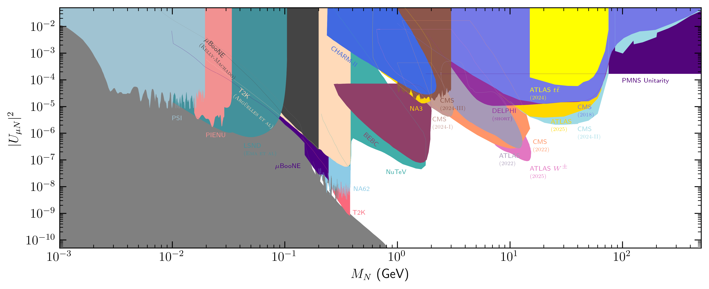
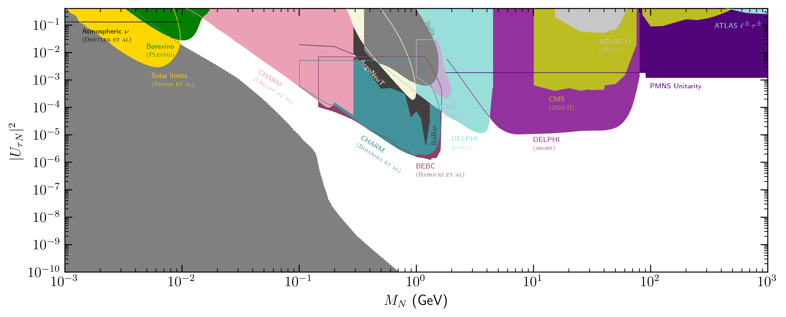

# Heavy Neutrino Limits

This package and repo tracks the constraints on the coupling and masses of heavy neutral leptons (HNL). To access it, simply clone this repository.

To use the underlying functions to create your own plots and latex files, you can install HNLimits as you would a standard PyPI package, ``python -m pip install HNLimits``. You can then import it in your Python script ``import HNLimits``.

All limits are kept track in this [](https://docs.google.com/spreadsheets/d/1TIpmkgOa63-8Sy75qh0YutI5XdRtiClU3aquUdmjqpc/edit?usp=sharing).

* We consider single flavor dominance scenarios, where the HNL mixes predominantly with either the electron, muon, or tau flavor.

* Following the [accompanying paper](https://arxiv.org/abs/2304.06772), we provide limits on the Wilson coefficients of dimesnion-six $\nu$ SMEFT operators as a function of the HNL mass $M\_{N}$.

* The code keeps track of limits in the region 1 MeV $< M_{N} < 100$ GeV.

Additions, comments, or suggestions should be directed to:
* Josu Hernández-García (josu.hernandez@ific.uv.es)
* Matheus Hostert (mhostert@g.harvard.edu)

--- 
**Citation info:**

``arxiv.org/abs/2304.06772``

```
@article{Fernandez-Martinez:2023phj,
    author = "Fern\'andez-Mart\'\i{}nez, Enrique and Gonz\'alez-L\'opez, Manuel and Hern\'andez-Garc\'\i{}a, Josu and Hostert, Matheus and L\'opez-Pav\'on, Jacobo",
    title = "{Effective portals to heavy neutral leptons}",
    eprint = "2304.06772",
    archivePrefix = "arXiv",
    primaryClass = "hep-ph",
    reportNumber = "FTUV-23-0303.1224, IFIC/23-09",
    doi = "10.1007/JHEP09(2023)001",
    journal = "JHEP",
    volume = "09",
    pages = "001",
    year = "2023"
}
```


---
## Limits on the mixing
<!-- 
Current compilation of bounds on the mixing of HNLs with a single flavor:


[Electron mixing](https://raw.githubusercontent.com/mhostert/N-SMEFT-Limits/main/plots/mixing/UeN_majorana.png)


[Muon mixing](https://raw.githubusercontent.com/mhostert/N-SMEFT-Limits/main/plots/mixing/UmuN_majorana.png)


[Tau mixing](https://raw.githubusercontent.com/mhostert/N-SMEFT-Limits/main/plots/mixing/UtauN_majorana.png)
 -->


<!-- BEGIN GENERATED MIXING REFERENCES -->

### Mixing Plot Citations

The captions and references below are generated from `tex_files/mixing_plots.tex` and `tex_files/mixing_plots.bib`.



Constraints on $|U_{e N}|^2$ as a function of the HNL mass $m_N$. Limits shown: $K$ universality (Bryman-Shrock) [[1](#mixing-ref-1)], $\pi$ universality (Bryman-Shrock) [[1](#mixing-ref-1)], $^{20}F$ $\beta$-decay [[2](#mixing-ref-2)], ATLAS $W^\pm$(2025) [[3](#mixing-ref-3)], ATLAS $t\bar t$(2024) [[4](#mixing-ref-4)], ATLAS (2019) [[5](#mixing-ref-5)], ATLAS (2022) [[6](#mixing-ref-6)], ATLAS (2024) [[7](#mixing-ref-7)], ATLAS (2025) [[8](#mixing-ref-8)], BEBC(Barouki et al) [[9](#mixing-ref-9)], Belle [[10](#mixing-ref-10)], Borexino [[11](#mixing-ref-11)], CHARM [[12](#mixing-ref-12)], CMS (2018) [[13](#mixing-ref-13)], CMS (2022) [[14](#mixing-ref-14)], CMS (2024-I) [[15](#mixing-ref-15)], CMS (2024-II) [[16](#mixing-ref-16)], Cosmology [[17](#mixing-ref-17)], DELPHI (long) [[18](#mixing-ref-18)], DELPHI (short) [[18](#mixing-ref-18)], L3 (2001) [[19](#mixing-ref-19)], LSND (Ema et al) [[20](#mixing-ref-20)], NA62 [[21](#mixing-ref-21)], NA62 ($\pi$ 2025) [[22](#mixing-ref-22)], PIENU (2017) [[23](#mixing-ref-23)], PMNS Unitarity [[24](#mixing-ref-24)], Super-Allowed $\beta$ decays (Bryman-Shrock) [[1](#mixing-ref-1)], T2K [[25](#mixing-ref-25)], TRIUMF [[26](#mixing-ref-26)].



Constraints on $|U_{\mu N}|^2$ as a function of the HNL mass $m_N$. Limits shown: $\mu$BooNE [[27](#mixing-ref-27)], $\mu$BooNE (Kelly-Machado) [[28](#mixing-ref-28)], ATLAS $W^\pm$(2025) [[3](#mixing-ref-3)], ATLAS $t\bar t$(2024) [[4](#mixing-ref-4)], ATLAS (2019) [[5](#mixing-ref-5)], ATLAS (2022) [[6](#mixing-ref-6)], ATLAS (2025) [[8](#mixing-ref-8)], BEBC [[29](#mixing-ref-29)], BNL-E949 [[30](#mixing-ref-30)], CHARM-II [[31](#mixing-ref-31)], CMS (2018) [[13](#mixing-ref-13)], CMS (2018-dilepton) [[32](#mixing-ref-32)], CMS (2022) [[14](#mixing-ref-14)], CMS (2024-I) [[15](#mixing-ref-15)], CMS (2024-II) [[16](#mixing-ref-16)], CMS (2024-III) [[33](#mixing-ref-33)], CMS (8TeV) [[34](#mixing-ref-34)], Cosmology [[17](#mixing-ref-17)], DELPHI (short) [[18](#mixing-ref-18)], KEK [[1](#mixing-ref-1)], LSND (Ema et al) [[20](#mixing-ref-20)], NA3 [[35](#mixing-ref-35)], NA62 [[36](#mixing-ref-36)], NuTeV [[37](#mixing-ref-37)], PIENU [[38](#mixing-ref-38)], PIENU(low $\mu$ energy) [[38](#mixing-ref-38)], PMNS Unitarity [[24](#mixing-ref-24)], PSI [[39](#mixing-ref-39)], T2K [[25](#mixing-ref-25)], T2K (Argüelles et al) [[40](#mixing-ref-40)].



Constraints on $|U_{\tau N}|^2$ as a function of the HNL mass $m_N$. Limits shown: ATLAS $\ell^\pm\tau^\pm$ [[41](#mixing-ref-41)], ATLAS $t\bar t$(2024) [[4](#mixing-ref-4)], ArgoNeuT [[42](#mixing-ref-42)], Atmospheric $\nu$ (Dentler et al) [[43](#mixing-ref-43)], BEBC(Barouki et al) [[9](#mixing-ref-9)], BaBar [[44](#mixing-ref-44)], Belle [[45](#mixing-ref-45)], Borexino (Plestid) [[46](#mixing-ref-46)], CHARM (Boiarska et al) [[47](#mixing-ref-47)], CHARM (Orloff et al) [[48](#mixing-ref-48)], CMS (2024-I) [[15](#mixing-ref-15)], CMS (2024-II) [[16](#mixing-ref-16)], Cosmology [[17](#mixing-ref-17)], DELPHI (long) [[18](#mixing-ref-18)], DELPHI (short) [[18](#mixing-ref-18)], PMNS Unitarity [[24](#mixing-ref-24)].

#### References

1. <a id="mixing-ref-1"></a>D. A. Bryman and R. Shrock; "Constraints on Sterile Neutrinos in the MeV to GeV Mass Range"; Phys. Rev. D 100, 073011 (2019); [doi:10.1103/PhysRevD.100.073011](https://doi.org/10.1103/PhysRevD.100.073011); [arXiv:1909.11198](https://arxiv.org/abs/1909.11198).
2. <a id="mixing-ref-2"></a>J. Deutsch, M. Lebrun, and R. Prieels; "Searches for admixture of massive neutrinos into the electron flavor"; Nucl. Phys. A 518, 149-155 (1990); [doi:10.1016/0375-9474(90)90541-S](https://doi.org/10.1016/0375-9474(90)90541-S).
3. <a id="mixing-ref-3"></a>Georges Aad et al.; "Search for heavy neutral leptons in decays of W bosons using leptonic and semi-leptonic displaced vertices in √(s) = 13 TeV pp collisions with the ATLAS detector"; JHEP 07, 196 (2025); [doi:10.1007/JHEP07(2025)196](https://doi.org/10.1007/JHEP07(2025)196); [arXiv:2503.16213](https://arxiv.org/abs/2503.16213).
4. <a id="mixing-ref-4"></a>Georges Aad et al.; "Search for heavy right-handed Majorana neutrinos in the decay of top quarks produced in proton-proton collisions at s=13 TeV with the ATLAS detector"; Phys. Rev. D 110, 112004 (2024); [doi:10.1103/PhysRevD.110.112004](https://doi.org/10.1103/PhysRevD.110.112004); [arXiv:2408.05000](https://arxiv.org/abs/2408.05000).
5. <a id="mixing-ref-5"></a>Georges Aad et al.; "Search for heavy neutral leptons in decays of W bosons produced in 13 TeV pp collisions using prompt and displaced signatures with the ATLAS detector"; JHEP 10, 265 (2019); [doi:10.1007/JHEP10(2019)265](https://doi.org/10.1007/JHEP10(2019)265); [arXiv:1905.09787](https://arxiv.org/abs/1905.09787).
6. <a id="mixing-ref-6"></a>Georges Aad et al.; "Search for Heavy Neutral Leptons in Decays of W Bosons Using a Dilepton Displaced Vertex in s=13 TeV pp Collisions with the ATLAS Detector"; Phys. Rev. Lett. 131, 061803 (2023); [doi:10.1103/PhysRevLett.131.061803](https://doi.org/10.1103/PhysRevLett.131.061803); [arXiv:2204.11988](https://arxiv.org/abs/2204.11988).
7. <a id="mixing-ref-7"></a>Georges Aad et al.; "Measurement of the W-boson mass and width with the ATLAS detector using proton–proton collisions at √(s)=7 TeV"; Eur. Phys. J. C 84, 1309 (2024); [doi:10.1140/epjc/s10052-024-13190-x](https://doi.org/10.1140/epjc/s10052-024-13190-x); [arXiv:2403.15085](https://arxiv.org/abs/2403.15085).
8. <a id="mixing-ref-8"></a>Georges Aad et al.; "Search for heavy neutral leptons in decays of W bosons produced in 13 TeV pp collisions using prompt signatures in the ATLAS detector"; Eur. Phys. J. C 86, 153 (2026); [doi:10.1140/epjc/s10052-025-15191-w](https://doi.org/10.1140/epjc/s10052-025-15191-w); [arXiv:2508.20929](https://arxiv.org/abs/2508.20929).
9. <a id="mixing-ref-9"></a>Ryan Barouki, Giacomo Marocco, and Subir Sarkar; "Blast from the past II: Constraints on heavy neutral leptons from the BEBC WA66 beam dump experiment"; SciPost Phys. 13, 118 (2022); [doi:10.21468/SciPostPhys.13.5.118](https://doi.org/10.21468/SciPostPhys.13.5.118); [arXiv:2208.00416](https://arxiv.org/abs/2208.00416).
10. <a id="mixing-ref-10"></a>D. Liventsev et al.; "Search for heavy neutrinos at Belle"; Phys. Rev. D 87, 071102 (2013); [Erratum: Phys.Rev.D 95, 099903 (2017)]; [doi:10.1103/PhysRevD.87.071102](https://doi.org/10.1103/PhysRevD.87.071102); [arXiv:1301.1105](https://arxiv.org/abs/1301.1105).
11. <a id="mixing-ref-11"></a>G. Bellini et al.; "New limits on heavy sterile neutrino mixing in B8 decay obtained with the Borexino detector"; Phys. Rev. D 88, 072010 (2013); [doi:10.1103/PhysRevD.88.072010](https://doi.org/10.1103/PhysRevD.88.072010); [arXiv:1311.5347](https://arxiv.org/abs/1311.5347).
12. <a id="mixing-ref-12"></a>F. Bergsma et al.; "A Search for Decays of Heavy Neutrinos in the Mass Range 0.5-GeV to 2.8-GeV"; Phys. Lett. B 166, 473-478 (1986); [doi:10.1016/0370-2693(86)91601-1](https://doi.org/10.1016/0370-2693(86)91601-1).
13. <a id="mixing-ref-13"></a>Albert M Sirunyan et al.; "Search for heavy neutral leptons in events with three charged leptons in proton-proton collisions at √(s) = 13 TeV"; Phys. Rev. Lett. 120, 221801 (2018); [doi:10.1103/PhysRevLett.120.221801](https://doi.org/10.1103/PhysRevLett.120.221801); [arXiv:1802.02965](https://arxiv.org/abs/1802.02965).
14. <a id="mixing-ref-14"></a>Armen Tumasyan et al.; "Search for long-lived heavy neutral leptons with displaced vertices in proton-proton collisions at √(s) =13 TeV"; JHEP 07, 081 (2022); [doi:10.1007/JHEP07(2022)081](https://doi.org/10.1007/JHEP07(2022)081); [arXiv:2201.05578](https://arxiv.org/abs/2201.05578).
15. <a id="mixing-ref-15"></a>Aram Hayrapetyan et al.; "Search for long-lived heavy neutral leptons decaying in the CMS muon detectors in proton-proton collisions at s=13 TeV"; Phys. Rev. D 110, 012004 (2024); [doi:10.1103/PhysRevD.110.012004](https://doi.org/10.1103/PhysRevD.110.012004); [arXiv:2402.18658](https://arxiv.org/abs/2402.18658).
16. <a id="mixing-ref-16"></a>Aram Hayrapetyan et al.; "Search for heavy neutral leptons in final states with electrons, muons, and hadronically decaying tau leptons in proton-proton collisions at √(s) = 13 TeV"; JHEP 06, 123 (2024); [doi:10.1007/JHEP06(2024)123](https://doi.org/10.1007/JHEP06(2024)123); [arXiv:2403.00100](https://arxiv.org/abs/2403.00100).
17. <a id="mixing-ref-17"></a>Nashwan Sabti, Andrii Magalich, and Anastasiia Filimonova; "An Extended Analysis of Heavy Neutral Leptons during Big Bang Nucleosynthesis"; JCAP 11, 056 (2020); [doi:10.1088/1475-7516/2020/11/056](https://doi.org/10.1088/1475-7516/2020/11/056); [arXiv:2006.07387](https://arxiv.org/abs/2006.07387).
18. <a id="mixing-ref-18"></a>P. Abreu et al.; "Search for neutral heavy leptons produced in Z decays"; Z. Phys. C 74, 57-71 (1997); [Erratum: Z.Phys.C 75, 580 (1997)]; [doi:10.1007/s002880050370](https://doi.org/10.1007/s002880050370).
19. <a id="mixing-ref-19"></a>P. Achard et al.; "Search for heavy isosinglet neutrino in e^+ e^- annihilation at LEP"; Phys. Lett. B 517, 67-74 (2001); [doi:10.1016/S0370-2693(01)00993-5](https://doi.org/10.1016/S0370-2693(01)00993-5); [arXiv:hep-ex/0107014](https://arxiv.org/abs/hep-ex/0107014).
20. <a id="mixing-ref-20"></a>Yohei Ema, Zhen Liu, Kun-Feng Lyu, and Maxim Pospelov; "Heavy Neutral Leptons from Stopped Muons and Pions"; JHEP 08, 169 (2023); [doi:10.1007/JHEP08(2023)169](https://doi.org/10.1007/JHEP08(2023)169); [arXiv:2306.07315](https://arxiv.org/abs/2306.07315).
21. <a id="mixing-ref-21"></a>Eduardo Cortina Gil et al.; "Search for heavy neutral lepton production in K+ decays to positrons"; Phys. Lett. B 807, 135599 (2020); [doi:10.1016/j.physletb.2020.135599](https://doi.org/10.1016/j.physletb.2020.135599); [arXiv:2005.09575](https://arxiv.org/abs/2005.09575).
22. <a id="mixing-ref-22"></a>Brigitte Bloch-Devaux et al.; "Search for heavy neutral leptons in π+ decays to positrons"; Phys. Lett. B 872, 140119 (2026); [doi:10.1016/j.physletb.2025.140119](https://doi.org/10.1016/j.physletb.2025.140119); [arXiv:2507.07345](https://arxiv.org/abs/2507.07345).
23. <a id="mixing-ref-23"></a>A. Aguilar-Arevalo et al.; "Improved search for heavy neutrinos in the decay π→ eν"; Phys. Rev. D 97, 072012 (2018); [doi:10.1103/PhysRevD.97.072012](https://doi.org/10.1103/PhysRevD.97.072012); [arXiv:1712.03275](https://arxiv.org/abs/1712.03275).
24. <a id="mixing-ref-24"></a>Mattias Blennow, Enrique Fernández-Martínez, Josu Hernández-García, Jacobo López-Pavón, Xabier Marcano, and Daniel Naredo-Tuero; "Bounds on lepton non-unitarity and heavy neutrino mixing"; JHEP 08, 030 (2023); [doi:10.1007/JHEP08(2023)030](https://doi.org/10.1007/JHEP08(2023)030); [arXiv:2306.01040](https://arxiv.org/abs/2306.01040).
25. <a id="mixing-ref-25"></a>K. Abe et al.; "Search for heavy neutrinos with the T2K near detector ND280"; Phys. Rev. D 100, 052006 (2019); [doi:10.1103/PhysRevD.100.052006](https://doi.org/10.1103/PhysRevD.100.052006); [arXiv:1902.07598](https://arxiv.org/abs/1902.07598).
26. <a id="mixing-ref-26"></a>D. I. Britton et al.; "Improved search for massive neutrinos in pi+ -> e+ neutrino decay"; Phys. Rev. D 46, R885-R887 (1992); [doi:10.1103/PhysRevD.46.R885](https://doi.org/10.1103/PhysRevD.46.R885).
27. <a id="mixing-ref-27"></a>P. Abratenko et al.; "Search for Heavy Neutral Leptons in Electron-Positron and Neutral-Pion Final States with the MicroBooNE Detector"; Phys. Rev. Lett. 132, 041801 (2024); [doi:10.1103/PhysRevLett.132.041801](https://doi.org/10.1103/PhysRevLett.132.041801); [arXiv:2310.07660](https://arxiv.org/abs/2310.07660).
28. <a id="mixing-ref-28"></a>Kevin James Kelly and Pedro A. N. Machado; "MicroBooNE experiment, NuMI absorber, and heavy neutral leptons"; Phys. Rev. D 104, 055015 (2021); [doi:10.1103/PhysRevD.104.055015](https://doi.org/10.1103/PhysRevD.104.055015); [arXiv:2106.06548](https://arxiv.org/abs/2106.06548).
29. <a id="mixing-ref-29"></a>Amanda M. Cooper-Sarkar et al.; "Search for Heavy Neutrino Decays in the BEBC Beam Dump Experiment"; Phys. Lett. B 160, 207-211 (1985); [doi:10.1016/0370-2693(85)91493-5](https://doi.org/10.1016/0370-2693(85)91493-5).
30. <a id="mixing-ref-30"></a>A. V. Artamonov et al.; "Search for heavy neutrinos in K^+→μ^+ν_H decays"; Phys. Rev. D 91, 052001 (2015); [Erratum: Phys.Rev.D 91, 059903 (2015)]; [doi:10.1103/PhysRevD.91.052001](https://doi.org/10.1103/PhysRevD.91.052001); [arXiv:1411.3963](https://arxiv.org/abs/1411.3963).
31. <a id="mixing-ref-31"></a>P. Vilain et al.; "Search for heavy isosinglet neutrinos"; Phys. Lett. B 343, 453-458 (1995); [doi:10.1016/0370-2693(94)01422-9](https://doi.org/10.1016/0370-2693(94)01422-9).
32. <a id="mixing-ref-32"></a>Albert M Sirunyan et al.; "Search for heavy Majorana neutrinos in same-sign dilepton channels in proton-proton collisions at √(s)=13 TeV"; JHEP 01, 122 (2019); [doi:10.1007/JHEP01(2019)122](https://doi.org/10.1007/JHEP01(2019)122); [arXiv:1806.10905](https://arxiv.org/abs/1806.10905).
33. <a id="mixing-ref-33"></a>Aram Hayrapetyan et al.; "Search for long-lived heavy neutrinos in the decays of B mesons produced in proton-proton collisions at √(s) = 13 TeV"; JHEP 06, 183 (2024); [doi:10.1007/JHEP06(2024)183](https://doi.org/10.1007/JHEP06(2024)183); [arXiv:2403.04584](https://arxiv.org/abs/2403.04584).
34. <a id="mixing-ref-34"></a>Vardan Khachatryan et al.; "Search for heavy Majorana neutrinos in e^±e^±+ jets and e^± μ^±+ jets events in proton-proton collisions at √(s)=8 TeV"; JHEP 04, 169 (2016); [doi:10.1007/JHEP04(2016)169](https://doi.org/10.1007/JHEP04(2016)169); [arXiv:1603.02248](https://arxiv.org/abs/1603.02248).
35. <a id="mixing-ref-35"></a>J. Badier et al.; "Mass and Lifetime Limits on New Longlived Particles in 300-GeV/c π^- Interactions"; Z. Phys. C 31, 21 (1986); [doi:10.1007/BF01559588](https://doi.org/10.1007/BF01559588).
36. <a id="mixing-ref-36"></a>Eduardo Cortina Gil et al.; "Search for K^+ decays to a muon and invisible particles"; Phys. Lett. B 816, 136259 (2021); [doi:10.1016/j.physletb.2021.136259](https://doi.org/10.1016/j.physletb.2021.136259); [arXiv:2101.12304](https://arxiv.org/abs/2101.12304).
37. <a id="mixing-ref-37"></a>A. Vaitaitis et al.; "Search for neutral heavy leptons in a high-energy neutrino beam"; Phys. Rev. Lett. 83, 4943-4946 (1999); [doi:10.1103/PhysRevLett.83.4943](https://doi.org/10.1103/PhysRevLett.83.4943); [arXiv:hep-ex/9908011](https://arxiv.org/abs/hep-ex/9908011).
38. <a id="mixing-ref-38"></a>A. Aguilar-Arevalo et al.; "Search for heavy neutrinos in π→μν decay"; Phys. Lett. B 798, 134980 (2019); [doi:10.1016/j.physletb.2019.134980](https://doi.org/10.1016/j.physletb.2019.134980); [arXiv:1904.03269](https://arxiv.org/abs/1904.03269).
39. <a id="mixing-ref-39"></a>M. Daum, B. Jost, R. M. Marshall, R. C. Minehart, W. A. Stephens, and K. O. H. Ziock; "Search for Admixtures of Massive Neutrinos in the Decay π^+ →μ^+ Neutrino"; Phys. Rev. D 36, 2624 (1987); [doi:10.1103/PhysRevD.36.2624](https://doi.org/10.1103/PhysRevD.36.2624).
40. <a id="mixing-ref-40"></a>Carlos A. Argüelles, Nicolò Foppiani, and Matheus Hostert; "Heavy neutral leptons below the kaon mass at hodoscopic neutrino detectors"; Phys. Rev. D 105, 095006 (2022); [doi:10.1103/PhysRevD.105.095006](https://doi.org/10.1103/PhysRevD.105.095006); [arXiv:2109.03831](https://arxiv.org/abs/2109.03831).
41. <a id="mixing-ref-41"></a>Georges Aad et al.; "Search for heavy Majorana neutrinos in vector boson scattering with τ-lepton final states with the ATLAS detector"; (2026); [arXiv:2607.27307](https://arxiv.org/abs/2607.27307).
42. <a id="mixing-ref-42"></a>R. Acciarri et al.; "New Constraints on Tau-Coupled Heavy Neutral Leptons with Masses mN=280–970 MeV"; Phys. Rev. Lett. 127, 121801 (2021); [doi:10.1103/PhysRevLett.127.121801](https://doi.org/10.1103/PhysRevLett.127.121801); [arXiv:2106.13684](https://arxiv.org/abs/2106.13684).
43. <a id="mixing-ref-43"></a>Mona Dentler, Álvaro Hernández-Cabezudo, Joachim Kopp, Pedro A. N. Machado, Michele Maltoni, Ivan Martinez-Soler, and Thomas Schwetz; "Updated Global Analysis of Neutrino Oscillations in the Presence of eV-Scale Sterile Neutrinos"; JHEP 08, 010 (2018); [doi:10.1007/JHEP08(2018)010](https://doi.org/10.1007/JHEP08(2018)010); [arXiv:1803.10661](https://arxiv.org/abs/1803.10661).
44. <a id="mixing-ref-44"></a>J. P. Lees et al.; "Search for heavy neutral leptons using tau lepton decays at BaBaR"; Phys. Rev. D 107, 052009 (2023); [doi:10.1103/PhysRevD.107.052009](https://doi.org/10.1103/PhysRevD.107.052009); [arXiv:2207.09575](https://arxiv.org/abs/2207.09575).
45. <a id="mixing-ref-45"></a>M. Nayak et al.; "Search for a heavy neutral lepton that mixes predominantly with the tau neutrino"; Phys. Rev. D 109, L111102 (2024); [doi:10.1103/PhysRevD.109.L111102](https://doi.org/10.1103/PhysRevD.109.L111102); [arXiv:2402.02580](https://arxiv.org/abs/2402.02580).
46. <a id="mixing-ref-46"></a>Ryan Plestid; "Luminous solar neutrinos II: Mass-mixing portals"; Phys. Rev. D 104, 075028 (2021); [Erratum: Phys.Rev.D 105, 099901 (2022)]; [doi:10.1103/PhysRevD.104.075028](https://doi.org/10.1103/PhysRevD.104.075028); [arXiv:2010.09523](https://arxiv.org/abs/2010.09523).
47. <a id="mixing-ref-47"></a>Iryna Boiarska, Alexey Boyarsky, Oleksii Mikulenko, and Maksym Ovchynnikov; "Constraints from the CHARM experiment on heavy neutral leptons with tau mixing"; Phys. Rev. D 104, 095019 (2021); [doi:10.1103/PhysRevD.104.095019](https://doi.org/10.1103/PhysRevD.104.095019); [arXiv:2107.14685](https://arxiv.org/abs/2107.14685).
48. <a id="mixing-ref-48"></a>J. Orloff, Alexandre N. Rozanov, and C. Santoni; "Limits on the mixing of tau neutrino to heavy neutrinos"; Phys. Lett. B 550, 8-15 (2002); [doi:10.1016/S0370-2693(02)02769-7](https://doi.org/10.1016/S0370-2693(02)02769-7); [arXiv:hep-ph/0208075](https://arxiv.org/abs/hep-ph/0208075).

<!-- END GENERATED MIXING REFERENCES -->
---
## Limits on the dimension-six $\nu$SMEFT operators

| Type                 | Name                                      | Operator                                                                                              | Notebook                               | Figure                                                                                                                                                                                                                                                                                                                                                 |
|----------------------|-------------------------------------------|-------------------------------------------------------------------------------------------------------|----------------------------------------|--------------------------------------------------------------------------------------------------------------------------------------------------------------------------------------------------------------------------------------------------------------------------------------------------------------------------------------------------------|
| Mixing               | $O\_{\rm mixing}$                                        | $\overline{L}\widetilde{H}N$                                                                              | [``0_limits_mixing.ipynb``](https://github.com/mhostert/Heavy-Neutrino-Limits/blob/5299bb1705eb20c4d38e4fb784b0d79805d698b7/0_limits_mixing.ipynb)                     | [electron](https://github.com/mhostert/N-SMEFT-Limits/blob/main/plots/mixing/UeN_majorana.pdf)  <br />  [muon](https://github.com/mhostert/N-SMEFT-Limits/blob/main/plots/mixing/UmuN_majorana.pdf)  <br />  [tau](https://github.com/mhostert/N-SMEFT-Limits/blob/main/plots/mixing/UtauN_majorana.pdf) |
| Higgs-dressed Mixing | $\mathcal{O}_{\rm LNH}^\alpha$            | $\overline{L}\widetilde{H}N (H^\dagger H)$                                                                | [``1_NSMEFT_LHN.ipynb``](https://github.com/mhostert/Heavy-Neutrino-Limits/blob/9319051131e9882ae451405bfc668275c44d5ec8/1_NSMEFT_LHN.ipynb)                 | [electron]()  <br />  [muon]()  <br />  [tau]()                                                                                                                                                                                                                                                          |
| Bosonic Currents     | $\mathcal{O}_{\rm HN}$                    | $\overline{N}\gamma^\mu N (H^\dagger i \overleftrightarrow{D}_\mu H)$                                 | [``2_NSMEFT_bosonic_NC.ipynb``](https://github.com/mhostert/Heavy-Neutrino-Limits/blob/f8abe77c5588d3891425ce6519fb3ac918982ec4/2_NSMEFT_bosonic_NC.ipynb)          | [Bosonic NC]()                                                                                                                                                                                                                                                                                                                                         |
|                      | $\mathcal{O}_{\rm HN\ell}^{\alpha}$       | $\overline{N}\gamma^\mu \ell_\alpha (\widetilde{H}^\dagger i \overleftrightarrow{D}_\mu H)$               | [``3_NSMEFT_bosonic_CC.ipynb``](https://github.com/mhostert/Heavy-Neutrino-Limits/blob/eb39159704ff02b221ff2793d39f9ff7faae5146/3_NSMEFT_bosonic_CC.ipynb)          | [Bosonic CC]()                                                                                                                                                                                                                                                                                                                                         |
| Moments              | $\mathcal{O}_{\rm NB}^{\alpha}$             | $\left(\overline{L}\_\alpha \sigma\_{\mu\nu} N \right)\widetilde{H} B^{\mu \nu }$                        | [``4_NSMEFT_moment_NB.ipynb``](https://github.com/mhostert/Heavy-Neutrino-Limits/blob/eb39159704ff02b221ff2793d39f9ff7faae5146/4_NSMEFT_moment_NB.ipynb)           | [Moment hypercharge]()                                                                                                                                                                                                                                                                                                                                 |
|                      | $\mathcal{O}_{\rm NW}^{\alpha}$             | $\left(\overline{L}\_\alpha \sigma\_{\mu \nu } N\right) \tau^a \widetilde{H} W^{\mu \nu }_{a}$               | [``5_NSMEFT_moment_NW.ipynb``](https://github.com/mhostert/Heavy-Neutrino-Limits/blob/f8abe77c5588d3891425ce6519fb3ac918982ec4/5_NSMEFT_moment_NW.ipynb)           | [Moment W]()                                                                                                                                                                                                                                                                                                                                           |
| 4-fermion NC     | $\mathcal{O}_{\rm ff}$   | $(\overline{f} \gamma^\mu f) (\overline{N} \gamma_\mu N)$ | [``6_NSMEFT_4fermion_NC_ff_LN.ipynb``](https://github.com/mhostert/Heavy-Neutrino-Limits/blob/4f1280cf6d940cf75e5384d54f849bc9c377cac0/6_NSMEFT_4fermion_NC_ff.ipynb)      | [4-fermion ee]()  <br /> [4-fermion uu]()  <br /> [4-fermion dd]()                                                                                                                                                                                                                                                                                                                            |
|                      | $\mathcal{O}_{\rm LN}^\alpha$             | $(\overline{L}\_\alpha \gamma^\mu L\_\alpha) (\overline{N} \gamma_\mu N)$                               | [``6_NSMEFT_4fermion_NC_ff_LN.ipynb``](https://github.com/mhostert/Heavy-Neutrino-Limits/blob/4f1280cf6d940cf75e5384d54f849bc9c377cac0/6_NSMEFT_4fermion_NC_ff.ipynb)      | [4-fermion LN]()                                                                                                                                                                                                                                                                                                                                    |
|                      | $\mathcal{O}_{\rm QN}$                    | $(\overline{Q}\_i \gamma^\mu Q\_i) (\overline{N} \gamma_\mu N)$                | [``7_NSMEFT_4fermion_NC_QN.ipynb``](https://github.com/mhostert/Heavy-Neutrino-Limits/blob/f8abe77c5588d3891425ce6519fb3ac918982ec4/7_NSMEFT_4fermion_NC_QN.ipynb)      | [4-fermion QN]()                                                                                                                                                                                                                                                                                                                                    |
| 4-fermion NC & CC     | $\mathcal{O}_{\rm LNL\ell}^{\alpha\beta}$ | $(\overline{L}\_\alpha N)\epsilon (\overline{L}\_\alpha \ell\_\beta)$                                    | [``8_NSMEFT_4fermion_LNLell.ipynb``](https://github.com/mhostert/Heavy-Neutrino-Limits/blob/f8abe77c5588d3891425ce6519fb3ac918982ec4/8_NSMEFT_4fermion_LNLell.ipynb)  | [4-fermion LNLell NC]()  <br />  [4-fermion LNLell CC]()                                                                                                                                                                                                                                                                                                                                |
| 4-fermion CC               | $\mathcal{O}_{\rm duN\ell}^{\alpha}$      | $\mathcal{Z}\_{ij}^{\rm duN\ell}(\overline{d}\_i \gamma^\mu u\_j) (\overline{N} \gamma_\mu \ell_\alpha)$ | [``9_NSMEFT_4fermion_CC_duNell.ipynb``](https://github.com/mhostert/Heavy-Neutrino-Limits/blob/f8abe77c5588d3891425ce6519fb3ac918982ec4/9_NSMEFT_4fermion_CC_duNell.ipynb) | [4-fermion duNell: electron]() <br /> [4-fermion duNell: muon]() <br /> [4-fermion duNell: tau]() <br />                                                                                                                                                                                                                                                                                                                                |
|                      | $\mathcal{O}_{\rm LNQd}^\alpha$           | $\mathcal{Z}^{\rm LNQd}\_{ij} (\overline{L}\_\alpha N)\epsilon (\overline{Q_i} d\_j)$                    | [``10_NSMEFT_4fermion_CC_LNQd.ipynb``](https://github.com/mhostert/Heavy-Neutrino-Limits/blob/f8abe77c5588d3891425ce6519fb3ac918982ec4/10_NSMEFT_4fermion_CC_LNQd.ipynb)   | [4-fermion LNQd: electron]()  <br /> [4-fermion LNQd: muon]()  <br /> [4-fermion LNQd: tau]()  <br />                                                                                                                                                                                                                                                                                                                                |
|                      | $\mathcal{O}_{\rm QuNL}^\alpha$           | $\mathcal{Z}^{\rm QuNL}\_{ij}(\overline{Q}\_i u\_j)(\overline{N} L\_\alpha)$                              | [``11_NSMEFT_4fermion_CC_QuNL.ipynb``](https://github.com/mhostert/Heavy-Neutrino-Limits/blob/f8abe77c5588d3891425ce6519fb3ac918982ec4/11_NSMEFT_4fermion_CC_QuNL.ipynb)   | [4-fermion QuNL: electron]()   <br /> [4-fermion QuNL: muon]()   <br /> [4-fermion QuNL: tau]()   <br />                                                                                                                                                                                                                                                                                                                                 |
